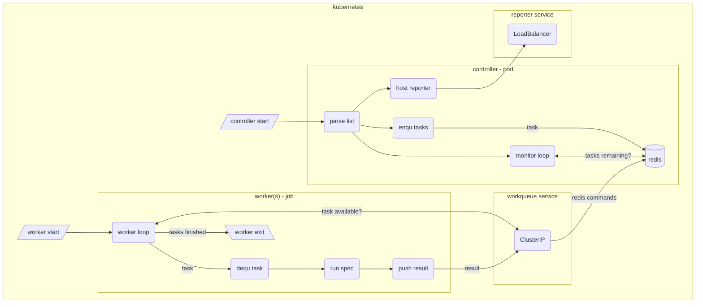

# funkytown
A Distributed System Proof of Concept (PoC) application

This project was designed to deal with a challenge in my company.  During a daily release of our core website, the dev team wanted 100's of Functional Specs (a mix of Webdriver, Cypress, and Playwright specs) to be executed "as fast as possible".  The PoC purposes using the ["Fine Parallel Processing Using a Work Queue" pattern](https://kubernetes.io/docs/tasks/job/fine-parallel-processing-work-queue/) in Kubernetes to solve this problem.

## Associated Technologies
- golang 1.18
- node
- typescript
- playwright
- docker
- kubectl
- helm
- Github Actions
- Azure Container Registry
- Azure Kubernetes Service

## The **Controller** application
The first part of the application is the `controller` pod, which hosts the **workqueue** in a local REDIS store.  It will load the list of specs and enqueue a **task** object for each **spec** / **browser** / **viewport** combination.  It will **filter out invalid combinations** (_such as **mobile** / **firefox**_). The `controller` will poll the **workqueue**, and update statistics as tasks finish.

The `controller` also hosts a `/results` endpoint (at port `:3000`), which is exposed via a **LoadBalancer** as the `reporter-service` (at port `:80`) which can be used to visualize all the **tasks** in the **workqueue**, their results, and the overall statistics.

The `controller` pod remains until terminated.

## The **Worker** application
The second part of the application is the `worker` pods, which are executed as a **batch Job** resource.  One to N `worker` pods pop **tasks** from the **workqueue** and execute the spec accordingly.  Each `worker` will then push a **result** back into the **workqueue**.  Once all `worker` pods exit, the batch job will be complete.

# Development and Deployment
This POC supports several development and deployment options:
- Local Development using Docker
- Local Kuberentes Deployment (using Windows Subsystem Linux 2 and Docker for Desktop)
- Azure Kubernetes Deployment (using Github Actions, Azure Container Registry, and Azure Kubernetes Service)

## Local Development using Docker
This POC contains instructions on running each application locally, as well as hosting within Docker for containarized validation.

See [`DEVELOPMENT.md`](DEVELOPMENT.md)

## Local Kubernetes Deployment
This POC contains information about local K8's deployment testing (using Windows Subsystem Linux 2 and Docker for Desktop)

See [`deploy/k8s/local/README.md`](deploy/k8s/local/README.md) for details

There is also a **helm** Chart for deployment as well

See [`deploy/k8s/local/helm/README.md`](deploy/k8s/local/helm/README.md)

## Azure Kubernetes Deployment
This POC integrates with Github Actions to build and publish images into Azure Container Registry (ACR).  Kuberentes resource .yaml files are then provided for deployment into and Azure Kubernetes Service (AKS)

See [`deploy/k8s/azure/README.md`](deploy/k8s/azure/README.md) for details

There is also a **helm** Chart for deployment as well

See [`deploy/k8s/azure/helm/README.md`](deploy/k8s/azure/helm/README.md)
