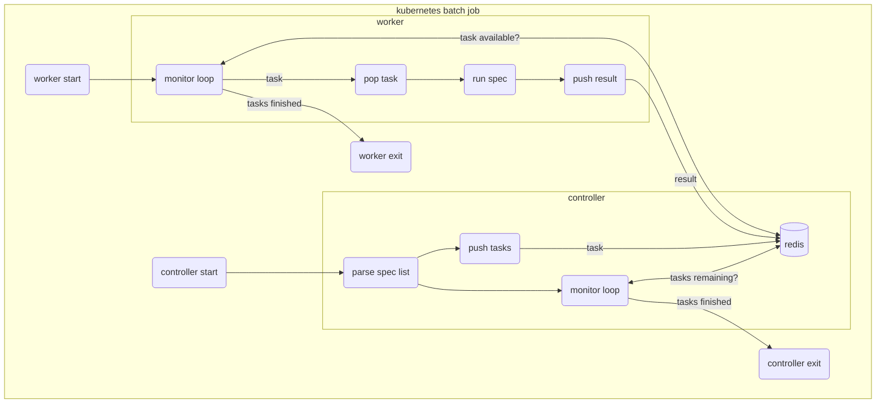

# funkytown
A Distributed System Proof of Concept application

This project was designed to deal with a challenge in my company.  During a daily release of our core website, the dev team wanted 100's of Functional Specs (a mix of Webdriver, Cypress, and Playwright specs) to be executed "as fast as possible".  My idea was to implement this, using the ["Fine Parallel Processing Using a Work Queue" pattern.](https://kubernetes.io/docs/tasks/job/fine-parallel-processing-work-queue/)

The batch job begins by deploying a `controller` which will load a list of specs from a `"spec" list`.  It then pushes `task` objects, for each `spec` / `browser` / `viewport` combination (eliminating **invalid `browser` / `viewport`** combinations, such as `mobile` / `firefox`) into a `REDIS` DB.  One to N `worker` pods pop `tasks` and execute the spec accordingly.  `worker` will then push a `result` back into the `REDIS` DB.

Once the `controller` and all `worker` pods exit, the batch job will be complete.



## Local Testing 
The `controller` and the `worker` can both be run locally using a docker hosted REDIS instance.

### Start local REDIS
Use docker to start a REDIS instance at localhost:6379
```
docker run -d -p 6379:6379 redislabs/redismod
```

> TIP: Using the `redis-cli`, you can easily reset the entire redis database using `FLUSHALL`

### Initialize the go workspace
This project uses `go work` features of golang `1.18` : https://go.dev/blog/get-familiar-with-workspaces

Create a workspace
```
go work init ./controller ./worker ./shared
```

### Start the controller
Start the controller providing the `REDIS_HOST`, `REDIS_PORT`, and `GROUP_TASKS_FILE`
```
REDIS_HOST=localhost REDIS_PORT=6379 GROUP_TASKS_FILE=specs/spec_context_map.json HTML_INDEX_FILE=controller/html/index.html go run github.com/bspain/funkytown/controller
```

Should be able to use the `redis-cli` to verify the "run metatdata" object was created sucessfully.
```
redis-cli
127.0.0.1:6379> hgetall runmeta
1) "runid"
2) "a_new_run"
3) "cmdcount"
4) "0"
5) "cmdfinishedcount"
6) "0"
7) "finished"
8) "0"
127.0.0.1:6379> exit
```

### Start the worker
Start the worker providing the `REDIS_HOST`, `REDIS_PORT`, and `SPEC_ROOT`
```
REDIS_HOST=localhost REDIS_PORT=6379 SPEC_ROOT=specs go run github.com/bspain/funkytown/worker
```

## Local Docker Development

### Build the applicaiton images
Build the `controller` image
```
docker build -f Dockerfile.controller -t controller:latest .
```

Build the `worker` image
```
docker build -f Dockerfile.worker -t worker:latest .
```

### Create the local docker network
The `controller` and `worker` instances will be communicating with each other, therefore they need a local network service.

```
docker network create funkytown
```

### Start the controller
Start the `controller` image

```
docker run -it --rm --name controller --net funkytown -p 6379:6379 -p 80:3000 controller:latest
```

### Start the worker
Start the `worker` image

```
docker run -it --name worker --net funkytown --ipc=host worker:latest
```

