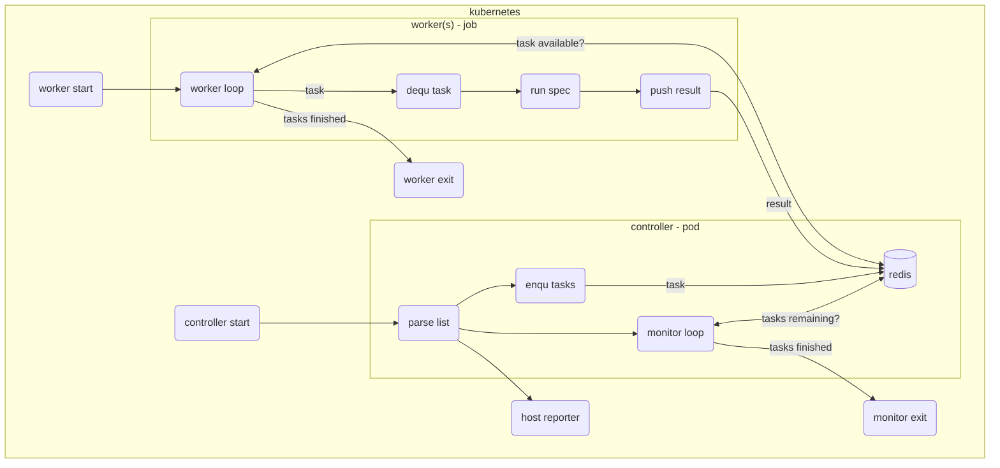

# funkytown
A Distributed System Proof of Concept application

This project was designed to deal with a challenge in my company.  During a daily release of our core website, the dev team wanted 100's of Functional Specs (a mix of Webdriver, Cypress, and Playwright specs) to be executed "as fast as possible".  My idea was to implement this, using the ["Fine Parallel Processing Using a Work Queue" pattern.](https://kubernetes.io/docs/tasks/job/fine-parallel-processing-work-queue/)

The first part of the application is the `controller` pod, which hosts the **workqueue**.  It will load a list of specs from a `parse "spec" list` and enqueue a `task` object for each `spec` / `browser` / `viewport` combination.  It will **filter out invalid combinations** such as `mobile` / `firefox`. Each `tasks` is hosted in a `REDIS` DB.  The controller `monitor loop` will poll the **workqueue**, and update statistics as tasks finish.  The `controller` also hosts a `reporter` (at port `:3000`) which can visualize all the `tasks` in the workqueue, their execution results, and the overall statistics.

The second part of the application is the `worker` pods, which are executed as a **batch Job** resource.  One to N `worker` pods pop `tasks` and execute the spec accordingly.  Each `worker` will then push a `result` back into the `REDIS` DB.  Once all `worker` pods exit, the batch job will be complete.

The `controller` pod remains until terminated.



## Local Testing 
The `controller` and the `worker` can both be run locally using a docker hosted REDIS instance.

### Start local REDIS
Use docker to start a REDIS instance at localhost:6379
```
docker run -d -p 6379:6379 redislabs/redismod
```

> TIP: Using the `redis-cli`, you can easily reset the entire redis database using `FLUSHALL`

### Initialize the go workspace
This project uses `go work` features of golang `1.18` : https://go.dev/blog/get-familiar-with-workspaces

Create a workspace
```
go work init ./controller ./worker ./shared
```

### Start the controller
Start the controller providing the `REDIS_HOST`, `REDIS_PORT`, and `GROUP_TASKS_FILE`
```
REDIS_HOST=localhost REDIS_PORT=6379 GROUP_TASKS_FILE=specs/spec_context_map.json HTML_INDEX_FILE=controller/html/index.html go run github.com/bspain/funkytown/controller
```

Should be able to use the `redis-cli` to verify the "run metatdata" object was created sucessfully.
```
redis-cli
127.0.0.1:6379> hgetall runmeta
1) "runid"
2) "a_new_run"
3) "cmdcount"
4) "0"
5) "cmdfinishedcount"
6) "0"
7) "finished"
8) "0"
127.0.0.1:6379> exit
```

### Start the worker
Start the worker providing the `REDIS_HOST`, `REDIS_PORT`, and `SPEC_ROOT`
```
REDIS_HOST=localhost REDIS_PORT=6379 SPEC_ROOT=specs go run github.com/bspain/funkytown/worker
```

## Local Docker Development

### <a name="ldd-build"></a>Build the application images
Build the `controller` image
```
docker build -f Dockerfile.controller -t controller:latest .
```

Build the `worker` image
```
docker build -f Dockerfile.worker -t worker:latest .
```

### Create the local docker network
The `controller` and `worker` instances will be communicating with each other, therefore they need a local network service.

```
docker network create funkytown
```

### Start the controller
Start the `controller` image

```
docker run -it --rm --name controller --net funkytown -p 6379:6379 -p 80:3000 controller:latest
```

### Start the worker
Start the `worker` image

```
docker run -it --name worker --net funkytown --ipc=host worker:latest
```

## Deployment to Kubernetes

> This POC is leveraging [Docker for Desktop with Kubernetes being hosted by the WSL2 engine](https://docs.docker.com/desktop/windows/wsl/) for local development
> The cloud based POC is using Azure Container Registry (ACR) and Azure Kubernetes Service (AKS)

### Starting the application in local kubernetes (Windows WSL2 + Docker for Desktop)
If the `controller` image is not already built, [build it now](#ldd-build).  Otherwise, you should see it in your local docker registry

```
docker images

REPOSITORY  TAG     IMAGE ID       CREATED         SIZE
controller  latest  e4ea2e71c9fd   2 minutes ago   1.01GB
```

Confirm that `kubectl` is working on your system, and that your current context is set to `docker-desktop`
```
kubectl config get-contexts

CURRENT   NAME             CLUSTER          AUTHINFO         NAMESPACE
*         docker-desktop   docker-desktop   docker-desktop
```

Deploy the `controller` pod
```
kubectl create -f deploy/k8s/local/controller.yaml
```

You can confirm the controller is up and running by viewing the logs from it
```
kubectl logs funkytown-controller 

Starting redis...
Redis server v=5.0.14 sha=00000000:0 malloc=jemalloc-5.1.0 bits=64 build=20357126fbf912e0
9:C 28 May 2022 14:56:16.411 # oO0OoO0OoO0Oo Redis is starting oO0OoO0OoO0Oo
9:C 28 May 2022 14:56:16.411 # Redis version=5.0.14, bits=64, commit=00000000, modified=0, pid=9, just started
9:C 28 May 2022 14:56:16.411 # Configuration loaded
Starting controller...
2022/05/28 14:56:16 funkytown Controller has started...
```

### Deploy the controller hosted services (workqueue and reporter)

Deploy the `workqueue` and `reporter` services

```
kubectl create -f deploy/k8s/local/workqueue-service.yaml 
kubectl create -f deploy/k8s/local/reporter-service.yaml
```

Using the `redis-cli` you should be able to connect to the REDIS DB hosted by the `controller` at port `30379` (note, this is assuming Docker-for-Desktop on WSL2 which creates a `kubernetes.docker.internal` mapping to `127.0.0.1`)

```
redis-cli -h kubernetes.docker.internal -p 30379

kubernetes.docker.internal:30379> hgetall runmeta
1) "tasksfinished"
2) "0"
3) "finished"
4) "0"
5) "runid"
6) "a_new_run"
7) "tasksremaining"
8) "12"
```
> In "PROD" we would not expose the REDIS port

You should also be able to view the `reporter` in a browser at http://kubernetes.docker.internal:30000/results

> Another interesting 'diagnostic' step to perform here, is to launch the `redis-cli` from within a new cluster pod, and confirm that the `funkytown-workqueue-service` is operational within the cluster.

```
kubectl run -i --tty temp --image redis --command "/bin/sh"

If you don't see a command prompt, try pressing enter.

# redis-cli -h funkytown-workqueue-service -p 40379
funkytown-workqueue-service:40379> hgetall runmeta
```

> Delete your temp redis-cli pod using `kubectl delete po temp`

### Deploy the cluster egress

TODO: Pods need egress to reach external websites

### Execute the worker as a Job

Deploy the `worker` job

```
docker build -f Dockerfile.worker -t worker:latest .
```